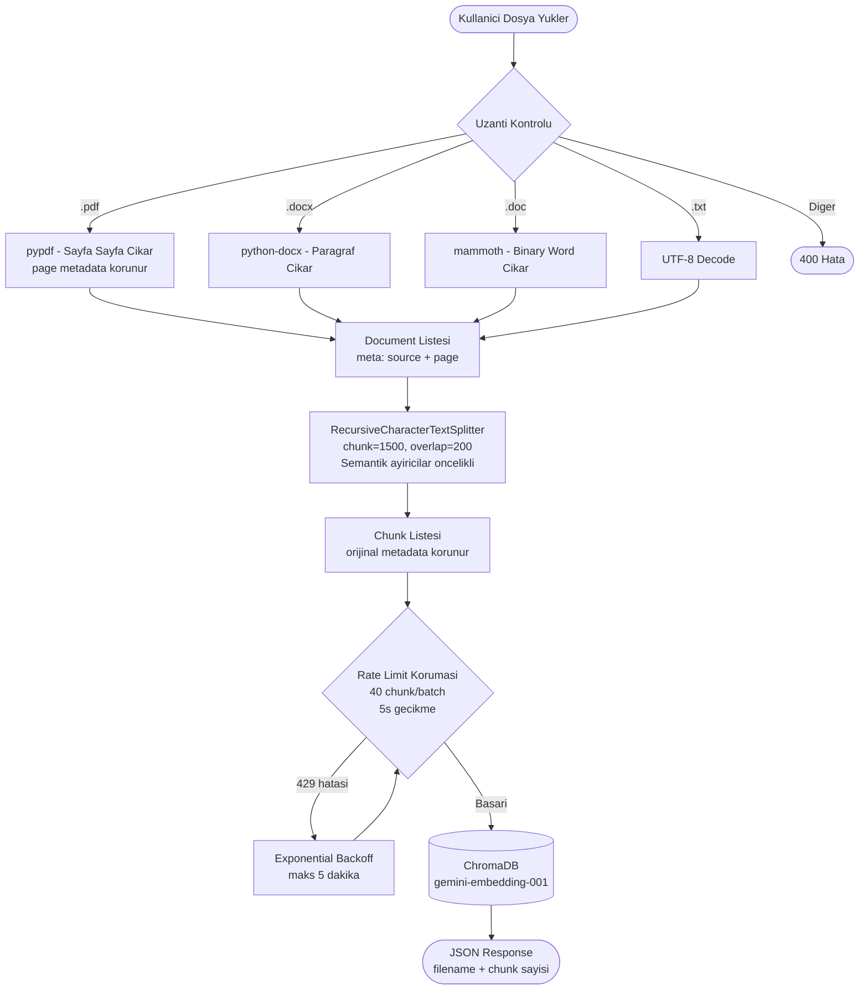
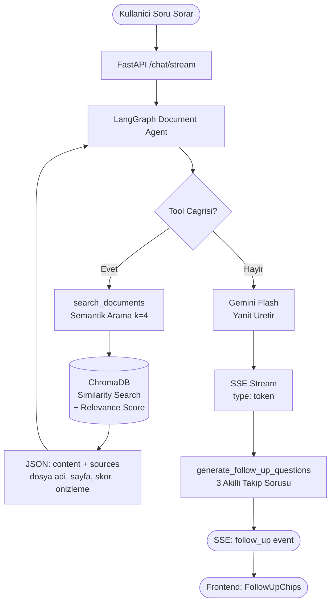

# Kendi Dokumanlarin ile Sohbet Et

YZTA P2P Challenge kapsaminda gelistirilen dokuman zekasi projesi.
Google Gemini + LangGraph + ChromaDB + Next.js ile uctan uca RAG sistemi.

---

## Hizli Baslangic

Projeyi ilk kez calistirmak icin sadece bu iki adimi yapmaniz yeterli:

**1. Repo'yu klonlayin ve .env dosyasini olusturun:**

```bash
git clone <repo-url>
cd YZTA-P2P-Project
cp .env.example .env
```

`.env` dosyasini bir metin editoru ile acin ve `GOOGLE_API_KEY` degerini doldurun.
API anahtarini buradan ucretsiz alabilirsiniz: https://aistudio.google.com/app/apikey

**2. Servisleri baslatin:**

```bash
docker-compose up --build
```

Ilk calistirmada Docker imajlari olusturulacagi icin birkaç dakika surebilir.
Islem bitince uygulamaya tarayicinizdan ulasabilirsiniz:

- Arayuz: http://localhost:3000
- API: http://localhost:8000
- API Dokumantasyonu (otomatik): http://localhost:8000/docs

---

## Docker Olmadan Calistirma (Gelistirme Ortami)

Kodu degistirerek deneyecekseniz bu yolu kullanin.
Iki terminal acmaniz gerekiyor: biri backend, biri frontend icin.

**Backend (Python):**

```bash
cd backend
cp ../.env.example .env
# .env icindeki GOOGLE_API_KEY degerini doldurun

pip install uv        # uv yoksa once bunu kurun
uv sync               # bagimlilikları yukler
uv run uvicorn app.main:app --reload --port 8000
```

**Frontend (Node.js):**

```bash
cd frontend
echo "NEXT_PUBLIC_API_BASE_URL=http://localhost:8000" > .env.local
npm install
npm run dev
```

Frontend http://localhost:3000 adresinde acilacaktir.

---

## Nasil Kullanilir

1. Sol panelden bir PDF, DOCX veya TXT dosyasi yukleyin.
2. Dosya yuklenince sohbet kutusuna sorunuzu yazin ve Enter'a basin.
3. Ajan dokumani semantik olarak arar, kaynaklari gosterir ve yanit uretir.
4. Her yanit altinda "Bunlari da sorabilirsiniz" onerisi cikabilir — bunlara tiklayarak devam edebilirsiniz.
5. Sol ustteki dropdown ile Dokuman Asistani veya Ozetleme Asistani arasinda gecis yapabilirsiniz.
6. Ozetleme butonuna (yazma alani yanindaki ikon) basinca tum doküman ozetlenir.

---

## Sistem Mimarisi

```
+------------------------------------------------------------------+
|                       KULLANICI TARAYICISI                       |
|   Next.js 14 (App Router)  .  Ant Design  .  TailwindCSS        |
|                                                                  |
|  +----------+  +-------------+  +------------+  +------------+  |
|  | Dokuman  |  |  Sohbet     |  |  Kaynak    |  | Follow-Up  |  |
|  | Yukleme  |  |  Arayuzu   |  |  Paneli    |  |  Chips     |  |
|  +----+-----+  +------+------+  +------------+  +------------+  |
+-------+--------------+-----------------------------------------+
        | POST /upload  | POST /chat/stream (SSE)
        v               v
+------------------------------------------------------------------+
|                  FastAPI BACKEND (Python 3.13)                   |
|                                                                  |
|  +------------------+       +------------------------------+    |
|  |  Upload Router   |       |        Chat Router           |    |
|  |                  |       |                              |    |
|  |  PDF  -> Sayfa   |       |  /stream -> SSE Generator    |    |
|  |  DOCX -> Metin   |       |  /invoke -> Tek yanit        |    |
|  |  TXT  -> Ham     |       |  /agents -> Ajan listesi     |    |
|  +--------+---------+       +---------------+--------------+    |
|           | split_documents()               |                   |
|           v                                v                   |
|  +------------------+       +------------------------------+    |
|  | RecursiveChar    |       |       LangGraph Agent        |    |
|  | TextSplitter     |       |                              |    |
|  | chunk=1500       |       |  document_agent  (Q&A)       |    |
|  | overlap=200      |       |  summarizer_agent (Ozet)     |    |
|  +--------+---------+       +---------------+--------------+    |
|           | embed & store                   | search_documents  |
|           v                                v                   |
|  +----------------------------------------------------------+   |
|  |               ChromaDB (PersistentClient)                |   |
|  |          Koleksiyon: "documents"                         |   |
|  |          Embedding: gemini-embedding-001                 |   |
|  +----------------------------------------------------------+   |
|                                                                  |
|  +----------------------------------------------------------+   |
|  |           Google Gemini (LLM)                           |   |
|  |      LangChain-Google-GenAI . Streaming=True            |   |
|  +----------------------------------------------------------+   |
+------------------------------------------------------------------+
```

---

## Dokuman Isleme Akis Semasi





---

## Challenge Kriterleri

| Kriter | Durum | Detay |
|--------|-------|-------|
| RAG Pipeline | OK | ChromaDB + LangChain + Gemini embeddings |
| LLM: Gemini | OK | gemini-2.5-flash-lite — LangGraph ajan |
| Embedding | OK | models/gemini-embedding-001 |
| PDF Destegi | OK | pypdf — sayfa bazli metadata |
| DOCX Destegi | OK | python-docx |
| DOC Destegi | OK | mammoth — binary Word |
| TXT Destegi | OK | UTF-8 decode |
| Semantik Chunking | OK | RecursiveCharacterTextSplitter |
| Kaynak Gosterme | OK | Dosya + sayfa + benzerlik skoru |
| Akilli Follow-Up | OK | LLM tabanli 3 takip sorusu |
| Ozetleme | OK | Ozel summarizer_agent |
| Streaming | OK | SSE — token bazli akis |
| Docker | OK | docker-compose — 2 servis |
| Async | OK | FastAPI + asyncio |

---

## Yapay Zeka Bilesenleri

### 1. Dokuman Asistani (dokuman-asistani)

LangGraph tabanli ReAct dongusu. Araclari:
- `search_documents(query)` — semantik arama, k=4 sonuc
- `list_documents()` — yuklu dosya listesi

Her yanita kaynak atfi zorunludur. Bilgi tabaninda olmayan konularda halucinasyonu reddeder.

### 2. Ozetleme Asistani (ozetleme-asistani)

Yapilandirilmis ozet ciktisi:
- Giris paragrafi
- Ana basliklar (madde madde)
- Onemli noktalar
- Kaynak dosya listesi

### 3. Follow-Up Soru Ureteci

Her AI yaniti sonrasi `generate_follow_up_questions()` cagirilir:
- SSE `follow_up` event'i olarak frontend'e iletilir
- `FollowUpChips` bileseni tiklanabilir butonlar olarak gosterir

### 4. Kaynak Paneli (SourcePanel)

Arama sonuclari sunlari icerir:
- Dosya adi + ikon (PDF/DOCX/TXT)
- Sayfa numarasi (PDF'ler icin)
- Benzerlik skoru (renk kodlu: yesil >= %75, mavi >= %50)
- Icerik onizlemesi (hover tooltip)

---

## Kullanilan Teknolojiler

| Arac | Kategori | Kullanim |
|------|----------|---------|
| LangGraph | AI Orkestrasyon | Ajan dongusu (model → tool → model) |
| LangChain | AI Zinciri | Text splitter, embeddings, ChromaDB adapter |
| ChromaDB | Vektor DB | Dokuman depolama ve semantik arama |
| FastAPI | Web Framework | Otomatik OpenAPI, async endpoint'ler |
| Ant Design | UI Kutuphanesi | Hazir bilesenler (Upload, Collapse, Tag) |
| TailwindCSS | Stil | Utility-first CSS |
| pydantic-settings | Konfigurasyon | Tip-guvenli ortam degiskeni yonetimi |

---

## API Referansi

### Dokuman Yukleme

```http
POST /upload/document
Content-Type: multipart/form-data

file: <PDF|DOCX|DOC|TXT dosyasi>
thread_id: <uuid> (opsiyonel — oturum izolasyonu icin)
```

```json
{
  "message": "'rapor.pdf' basariyla yuklendi ve 24 parcaya bolundu.",
  "filename": "rapor.pdf",
  "chunks": 24
}
```

### Sohbet (SSE Streaming)

```http
POST /chat/stream
Content-Type: application/json

{
  "message": "Bu raporun ana bulgulari neler?",
  "thread_id": "uuid-v4",
  "agent_id": "dokuman-asistani",
  "stream_tokens": true
}
```

SSE Event Tipleri:

| type | Icerik | Aciklama |
|------|--------|----------|
| token | "content": "..." | LLM token akisi |
| message | {type, content, tool_calls, ...} | Tam mesaj (AI / tool) |
| follow_up | {"questions": ["...", "...", "..."]} | Takip sorulari |
| error | "content": "..." | Hata mesaji |
| end | — | Akis tamamlandi |

### Ajan Listesi

```http
GET /chat/agents
```

```json
[
  {"key": "dokuman-asistani", "description": "Yuklenen dokumanlar uzerinde soru-cevap yapan akilli asistan."},
  {"key": "ozetleme-asistani", "description": "Dokumanlari yapilandirilmis sekilde ozetleyen uzman ajan."}
]
```

---

## Ortam Degiskenleri

| Degisken | Varsayilan | Aciklama |
|----------|-----------|----------|
| `GOOGLE_API_KEY` | (zorunlu) | Google AI Studio API anahtari |
| `DEFAULT_MODEL` | `gemini-2.5-flash-lite` | Ana Gemini LLM modeli |
| `FAST_MODEL` | `gemini-1.5-flash` | Takip sorulari icin hizli model |
| `EMBEDDING_MODEL` | `models/gemini-embedding-001` | Google embedding modeli |
| `CHROMA_PATH` | `resource/chroma_db` | ChromaDB kalici depolama yolu |
| `DEBUG` | `false` | Hata ayiklama modu |

---

## Proje Yapisi

```
YZTA-P2P-Project/
├── docker-compose.yml          # 2 servis: backend + frontend
├── .env.example                # Ortam degiskeni sablonu
│
├── backend/
│   ├── Dockerfile
│   ├── pyproject.toml          # uv bagimlilik yonetimi
│   └── app/
│       ├── main.py             # FastAPI uygulamasi
│       ├── core/
│       │   └── config.py       # pydantic-settings konfigurasyonu
│       ├── api/
│       │   ├── chat_routes.py  # /chat endpoint'leri (stream, invoke, agents)
│       │   ├── upload_routes.py# /upload endpoint'leri (PDF/DOCX/DOC/TXT)
│       │   └── schema/
│       │       └── chatSchema.py
│       ├── ai/
│       │   ├── agent/
│       │   │   ├── agents.py           # Ajan kayit defteri
│       │   │   ├── document_agent.py   # Q&A LangGraph ajani
│       │   │   └── summarizer_agent.py # Ozetleme LangGraph ajani
│       │   ├── rag/
│       │   │   └── chromaClient.py     # ChromaDB + Gemini embedding
│       │   ├── tools/
│       │   │   └── document_tools.py   # search_documents, list_documents
│       │   ├── follow_up.py            # Takip sorusu ureteci
│       │   └── llm.py                  # Gemini model fabrikasi
│       └── utils/
│           └── chat_utils.py           # Mesaj donusturuculer
│
└── frontend/
    ├── Dockerfile
    ├── next.config.mjs
    └── app/
        ├── layout.tsx              # Root layout (Sider, Header, Context)
        ├── components/
        │   ├── AgentSelector.tsx   # Ajan secici dropdown
        │   ├── DocumentUpload.tsx  # Dosya yukleme paneli
        │   ├── NewChatButton.tsx
        │   ├── SessionListItem.tsx
        │   └── SiderComponent.tsx
        └── chat/
            ├── components/
            │   ├── ChatComponent.tsx  # Ana sohbet bileseni
            │   ├── MessageBubble.tsx  # Mesaj balonu
            │   ├── MessageInput.tsx   # Girdi alani
            │   ├── SourcePanel.tsx    # Kaynak gosterme paneli
            │   └── FollowUpChips.tsx  # Takip sorusu butonlari
            ├── hooks/
            │   ├── useStreamChat.ts   # SSE stream yonetimi
            │   └── useChatActions.ts  # Sohbet aksiyonlari
            └── types/
                └── chat.types.ts     # TypeScript tip tanimlari
```
