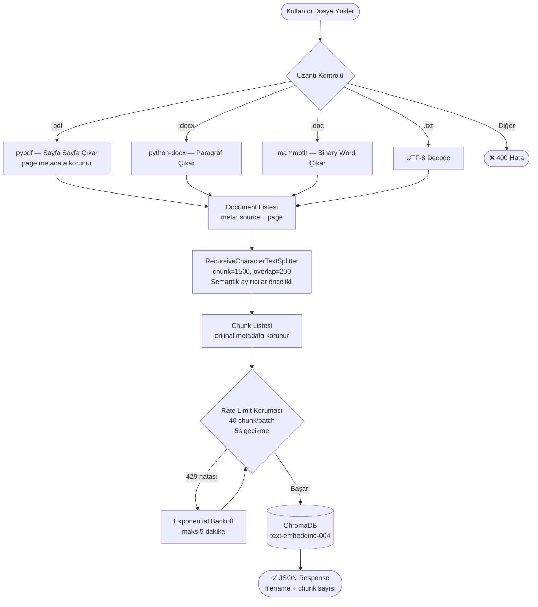
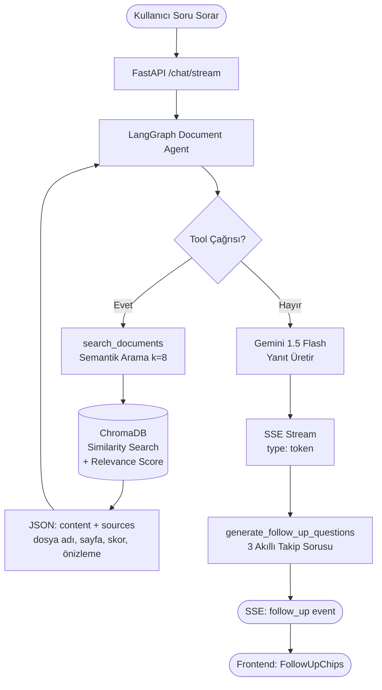

# 📄 Kendi Dokümanların ile Sohbet Et

> **YZTA P2P Challenge — "Kendi Dokümanların ile Sohbet Et"**
> Google Gemini 1.5 Flash + LangGraph + ChromaDB + Next.js ile uçtan uca RAG (Retrieval-Augmented Generation) sistemi.

---

## 🏗️ Sistem Mimarisi

```
┌─────────────────────────────────────────────────────────────────┐
│                        KULLANICI TARAYICISI                     │
│   Next.js 14 (App Router)  ·  Ant Design  ·  TailwindCSS       │
│                                                                  │
│  ┌──────────┐  ┌─────────────┐  ┌────────────┐  ┌───────────┐  │
│  │ Doküman  │  │  Sohbet     │  │  Kaynak    │  │ Follow-Up │  │
│  │ Yükleme  │  │  Arayüzü   │  │  Paneli    │  │  Chips    │  │
│  └────┬─────┘  └──────┬──────┘  └────────────┘  └───────────┘  │
└───────┼───────────────┼────────────────────────────────────────┘
        │ POST /upload  │ POST /chat/stream (SSE)
        ▼               ▼
┌───────────────────────────────────────────────────────────────┐
│                  FastAPI BACKEND (Python 3.13)                 │
│                                                               │
│  ┌──────────────────┐       ┌──────────────────────────────┐  │
│  │  Upload Router   │       │       Chat Router            │  │
│  │                  │       │                              │  │
│  │  PDF → Sayfa     │       │  /stream → SSE Generator     │  │
│  │  DOCX/DOC → Metin│       │  /invoke → Tek yanıt         │  │
│  │  TXT → Ham metin │       │  /agents → Ajan listesi      │  │
│  └────────┬─────────┘       └──────────────┬───────────────┘  │
│           │ split_documents()              │                   │
│           ▼                               ▼                   │
│  ┌──────────────────┐       ┌──────────────────────────────┐  │
│  │ RecursiveChar    │       │     LangGraph Agent          │  │
│  │ TextSplitter     │       │                              │  │
│  │ chunk=1500       │       │  document_agent (Q&A)        │  │
│  │ overlap=200      │       │  summarizer_agent (Özet)     │  │
│  └────────┬─────────┘       └──────────────┬───────────────┘  │
│           │ embed & store                  │ search_documents  │
│           ▼                               ▼                   │
│  ┌──────────────────────────────────────────────────────────┐  │
│  │              ChromaDB (PersistentClient)                 │  │
│  │         Koleksiyon: "documents"                          │  │
│  │         Embedding: text-embedding-004                    │  │
│  └──────────────────────────────────────────────────────────┘  │
│                                                               │
│  ┌──────────────────────────────────────────────────────────┐  │
│  │           Google Gemini 1.5 Flash (LLM)                 │  │
│  │      LangChain-Google-GenAI · Streaming=True             │  │
│  └──────────────────────────────────────────────────────────┘  │
└───────────────────────────────────────────────────────────────┘
```

---

## 📊 Doküman İşleme Akış Şeması





---

## ✅ Challenge Kriterleri Karşılama Tablosu

| Kriter | Durum | Detay |
|--------|-------|-------|
| **RAG Pipeline** | ✅ | ChromaDB + LangChain + Gemini embeddings |
| **LLM: Gemini** | ✅ | `gemini-1.5-flash` — LangGraph ajan |
| **Embedding: text-embedding-004** | ✅ | `models/text-embedding-004` |
| **PDF Desteği** | ✅ | pypdf — sayfa bazlı metadata |
| **DOCX Desteği** | ✅ | python-docx |
| **DOC Desteği** | ✅ | mammoth — binary Word |
| **TXT Desteği** | ✅ | UTF-8 decode |
| **Semantik Chunking** | ✅ | RecursiveCharacterTextSplitter |
| **Kaynak Gösterme** | ✅ | Dosya + sayfa + benzerlik skoru |
| **Akıllı Follow-Up** | ✅ | LLM tabanlı 3 takip sorusu |
| **Özetleme** | ✅ | Özel summarizer_agent |
| **Streaming** | ✅ | SSE — token bazlı akış |
| **Docker** | ✅ | docker-compose — 2 servis |
| **Async** | ✅ | FastAPI + asyncio |

---

## 🧠 Yapay Zeka Bileşenleri

### 1. Doküman Asistanı (`dokuman-asistani`)
LangGraph tabanlı ReAct döngüsü. Araçları:
- `search_documents(query)` — semantik arama, k=8 sonuç
- `list_documents()` — yüklü dosya listesi

Her yanıtta kaynak atıfı zorunludur; bilgi tabanında olmayan konularda halüsinasyonu reddeder.

### 2. Özetleme Asistanı (`ozetleme-asistani`)
Yapılandırılmış özet çıktısı:
- Giriş paragrafı
- Ana başlıklar (madde madde)
- Önemli noktalar
- Kaynak dosya listesi

### 3. Follow-Up Soru Üreteci
Her AI yanıtı sonrası `generate_follow_up_questions()` çağrılır:
- SSE `follow_up` event'i olarak frontend'e iletilir
- `FollowUpChips` bileşeni tıklanabilir butonlar olarak gösterir

### 4. Kaynak Paneli (`SourcePanel`)
Arama sonuçları şunları içerir:
- Dosya adı + ikon (PDF/DOCX/TXT)
- Sayfa numarası (PDF'ler için)
- Benzerlik skoru (renk kodlu: yeşil ≥ %75, mavi ≥ %50)
- İçerik önizlemesi (hover tooltip)

---

## 🛠️ Kullanılan Low-Code Yaklaşımlar

| Araç | Kategori | Kullanım |
|------|----------|---------|
| **LangGraph** | AI Orkestrasyon | Ajan döngüsü (model → tool → model) |
| **LangChain** | AI Zinciri | Text splitter, embeddings, ChromaDB adapter |
| **ChromaDB** | Vektör DB | Döküman depolama ve semantik arama |
| **FastAPI** | Web Framework | Otomatik OpenAPI, async endpoint'ler |
| **Ant Design** | UI Kütüphanesi | Hazır bileşenler (Upload, Collapse, Tag) |
| **TailwindCSS** | Stil | Utility-first CSS |
| **pydantic-settings** | Konfigürasyon | Tip-güvenli ortam değişkeni yönetimi |

---

## 🚀 Kurulum ve Çalıştırma

### Docker ile (Önerilen)

```bash
# 1. Repo'yu klonlayın
git clone <repo-url>
cd YZTA-P2P-Project

# 2. .env dosyasını oluşturun
cp .env.example .env
# .env içindeki GOOGLE_API_KEY değerini doldurun

# 3. Servisleri başlatın
docker-compose up --build
```

Uygulama adresleri:
- **Frontend:** http://localhost:3000
- **Backend API:** http://localhost:8000
- **API Dokümantasyonu:** http://localhost:8000/docs

### Yerel Geliştirme

**Backend:**
```bash
cd backend
cp ../.env.example .env
# .env içindeki GOOGLE_API_KEY değerini doldurun

pip install uv
uv sync
uv run uvicorn app.main:app --reload --port 8000
```

**Frontend:**
```bash
cd frontend
echo "NEXT_PUBLIC_API_BASE_URL=http://localhost:8000" > .env.local
npm install
npm run dev
```

---

## 📡 API Referansı

### Doküman Yükleme

```http
POST /upload/document
Content-Type: multipart/form-data

file: <PDF|DOCX|DOC|TXT dosyası>
```

```json
{
  "message": "'rapor.pdf' başarıyla yüklendi ve 24 parçaya bölündü.",
  "filename": "rapor.pdf",
  "chunks": 24
}
```

### Sohbet (SSE Streaming)

```http
POST /chat/stream
Content-Type: application/json

{
  "message": "Bu raporun ana bulguları neler?",
  "thread_id": "uuid-v4",
  "agent_id": "dokuman-asistani",
  "stream_tokens": true
}
```

**SSE Event Tipleri:**

| `type` | İçerik | Açıklama |
|--------|--------|----------|
| `token` | `"content": "..."` | LLM token akışı |
| `message` | `{type, content, tool_calls, ...}` | Tam mesaj (AI / tool) |
| `follow_up` | `{"questions": ["...", "...", "..."]}` | Takip soruları |
| `error` | `"content": "..."` | Hata mesajı |
| `end` | — | Akış tamamlandı |

### Ajan Listesi

```http
GET /chat/agents
```

```json
[
  {"key": "dokuman-asistani", "description": "Yüklenen dokümanlar üzerinde soru-cevap yapan akıllı asistan."},
  {"key": "ozetleme-asistani", "description": "Dokümanları yapılandırılmış şekilde özetleyen uzman ajan."}
]
```

---

## ⚙️ Ortam Değişkenleri

| Değişken | Varsayılan | Açıklama |
|----------|-----------|----------|
| `GOOGLE_API_KEY` | *(zorunlu)* | Google AI Studio API anahtarı |
| `DEFAULT_MODEL` | `gemini-1.5-flash` | Kullanılacak Gemini LLM modeli |
| `EMBEDDING_MODEL` | `models/text-embedding-004` | Google embedding modeli |
| `CHROMA_PATH` | `resource/chroma_db` | ChromaDB kalıcı depolama yolu |
| `DEBUG` | `false` | Hata ayıklama modu |

---

## 📁 Proje Yapısı

```
YZTA-P2P-Project/
├── docker-compose.yml          # 2 servis: backend + frontend
├── .env.example                # Ortam değişkeni şablonu
│
├── backend/
│   ├── Dockerfile
│   ├── pyproject.toml          # uv bağımlılık yönetimi
│   └── app/
│       ├── main.py             # FastAPI uygulaması
│       ├── core/
│       │   └── config.py       # pydantic-settings konfigürasyonu
│       ├── api/
│       │   ├── chat_routes.py  # /chat endpoint'leri (stream, invoke, agents)
│       │   ├── upload_routes.py# /upload endpoint'leri (PDF/DOCX/DOC/TXT)
│       │   └── schema/
│       │       └── chatSchema.py
│       ├── ai/
│       │   ├── agent/
│       │   │   ├── agents.py           # Ajan kayıt defteri
│       │   │   ├── document_agent.py   # Q&A LangGraph ajanı
│       │   │   └── summarizer_agent.py # Özetleme LangGraph ajanı
│       │   ├── rag/
│       │   │   └── chromaClient.py     # ChromaDB + Gemini embedding
│       │   ├── tools/
│       │   │   └── document_tools.py   # search_documents, list_documents
│       │   ├── follow_up.py            # Takip sorusu üreteci
│       │   └── llm.py                  # Gemini model fabrikası
│       └── utils/
│           └── chat_utils.py           # Mesaj dönüştürücüler
│
└── frontend/
    ├── Dockerfile
    ├── next.config.mjs
    └── app/
        ├── layout.tsx              # Root layout (Sider, Header, Context)
        ├── components/
        │   ├── AgentSelector.tsx   # Ajan seçici dropdown
        │   ├── DocumentUpload.tsx  # Dosya yükleme paneli
        │   ├── NewChatButton.tsx
        │   ├── SessionListItem.tsx
        │   └── SiderComponent.tsx
        └── chat/
            ├── components/
            │   ├── ChatComponent.tsx  # Ana sohbet bileşeni
            │   ├── MessageBubble.tsx  # Mesaj balonu
            │   ├── MessageInput.tsx   # Girdi alanı
            │   ├── SourcePanel.tsx    # Kaynak gösterme paneli
            │   └── FollowUpChips.tsx  # Takip sorusu butonları
            ├── hooks/
            │   ├── useStreamChat.ts   # SSE stream yönetimi
            │   └── useChatActions.ts  # Sohbet aksiyonları
            └── types/
                └── chat.types.ts     # TypeScript tip tanımları
```

---

## 🔒 Güvenlik Notları

- `.env` dosyalarını asla Git'e commit etmeyin
- `GOOGLE_API_KEY` değerini düzenli olarak yenileyin
- Production'da `DEBUG=false` ve `CORS allow_origins` kısıtlı tutun
- ChromaDB volume'u yedekleyin: `docker-compose.yml` → `chroma_data`

---

## 📜 Lisans

MIT License — YZTA P2P Challenge 2025
